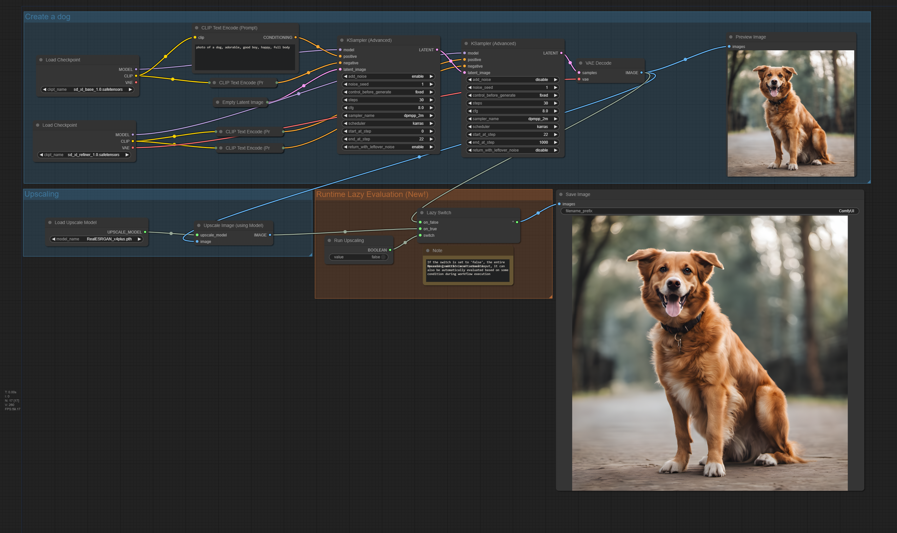
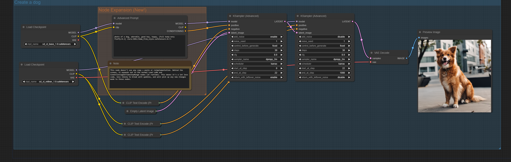
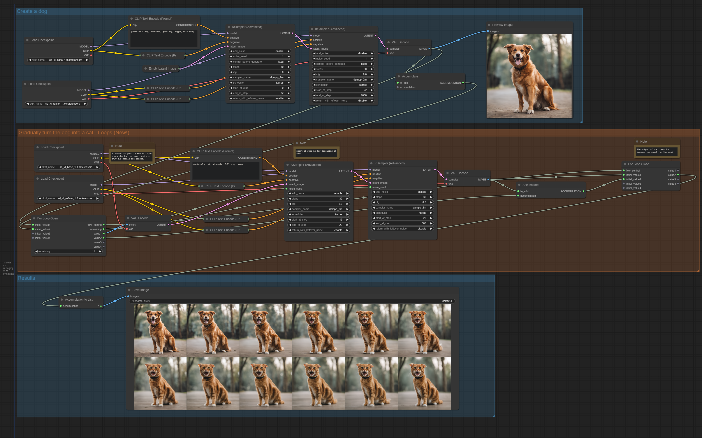
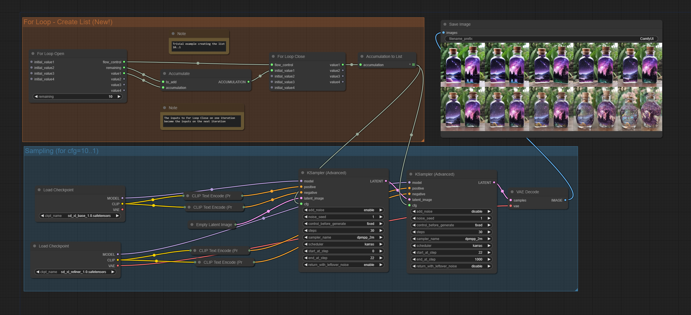

# Execution Inversion Demo

This node pack contains a set of nodes meant to demonstrate (and test) the capabilities of the new execution model introduced to ComfyUI in [PR #2666](https://github.com/comfyanonymous/ComfyUI/pull/2666)

## Examples
Note that all of the screenshots of workflows contain the actual workflows embedded in the metadata. Drag them to ComfyUI to try them out.

### Lazy Evaluation
Tired of manually muting large sections of your graph (e.g. upscaling) until your image is ready for it? Lazy evaluation means that areas of your graph that aren't actually used in the result won't be evaluated. Now, a simple boolean input of 'Enable Upscaling' can control whether you run that part of your graph.

Because lazy evaluation happens at runtime, the input to this switch can be anything -- for example, you can only run the part of your workflow for fixing faces if a face is found in the input image.

### Node Expansion
Nodes now have the ability to expand into multiple other nodes at runtime. The "Advanced Prompt" node in this pack demonstrates this. It allows input in a style similar to A111 format. For example, you can use text like `a dog, [full body:fluffy:0.3]` to use the prompt `a dog, full body` during the first 30% of sampling and `a dog, fluffy` during the last 70%. This node also allows use of loras just by typing `<lora:SDXL/16mm_film_style.safetensors:0.7>` to load a LoRA with 70% strength.

All of that could be done before. The difference here is that behind the scenes, it's just expanding to the existing `ConditioningSetTimestepRange` and `Load LoRA` nodes. Because of this, no code is copy + pasted and no internal functions are called. This means the implementation takes *a lot* less code, is less likely to break in ComfyUI updates, and will take advantage of any future changes to those nodes.

This functionality also sets the stage for node packs that implement true "subgraphs" or reusable components.

### For Loops
Perhaps most excitingly, this PR introduces the ability to have loops within workflows. There are all sorts of interesting uses for this functionality. For example, here's a dog transforming into a cat:

For a more simple example, in this one we're just generating a list of the numbers `10, 9, 8, 7, 6, 5, 4, 3, 2, 1` and then using those for the `cfg` input of the sampler to see what it looks like.

